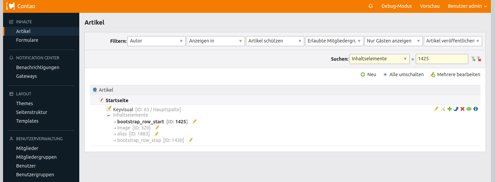

Aceid bundle
============

This is a bundle for [Contao CMS] (version 4.9.x).

With trilobit_aceid you can make content element ids visible in article context and eben use them in Search.

If add Aceid to an existing Contao installation with articles present, make sure you initialize data in "System > Maintenance".

Aceid Bundle
============

Dies ist ein Bundle für [Contao CMS] (Version 4.9.x).

Aceid macht die IDs der Inhaltselemente im Artikelkontext sichtbar und durchsuchbar.

Achtung: diese Anwendung sollte über "System > Systemwartung" initialsiert werden, wenn bereits Artikel in der Contao-Installation vorhanden sind.

Screenshots
===========

Installation
------------

Install the extension via composer: [trilobit-gmbh/contao-aceid-bundle](https://packagist.org/packages/trilobit-gmbh/contao-aceid-bundle).

Kompatibilität / Getestet / Compatibility / Tested
--------------------------------------------------

- Contao version ~4.9
- Contao version ~4.13

